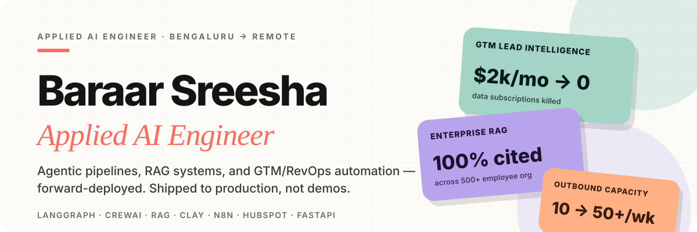

<!--
  SEO & GEO Metadata
  Primary Keywords: Applied AI Engineer, AI Agent Engineer, GTM AI Engineer, RevOps Automation, GenAI Agents, RAG Systems
  Secondary Keywords: LangGraph, CrewAI, AutoGen, LangChain, FastAPI, HubSpot Automation, Clay, n8n, Lead Enrichment, LLM APIs
  Entity: Baraar Sreesha Sreenivas (aka Baraar Sreesha / Sreesha Baraar / Sreesha Sreenivas) | ssbaraar | Bengaluru, India
  sameAs: linkedin.com/in/baraarsreesha · github.com/ssbaraar · twitter.com/sreesha_baraar · huggingface.co/ssbaraar · medium.com/@baraarsreeshasreenivas · ssbaraar-portfolio.vercel.app
  Audience: Recruiters, B2B SaaS Companies, GTM/RevOps Teams, AI-first Startups
-->

<!-- ════════════════════════════════════════════════
     HERO — project-native SVG (brand colors: cream/ink/coral/mint/lavender)
════════════════════════════════════════════════ -->
<div align="center">
  
</div>

<br />

<div align="center">
  <a href="https://www.linkedin.com/in/baraarsreesha">
    
  </a>&nbsp;
  <a href="https://twitter.com/sreesha_baraar">
    
  </a>&nbsp;
  <a href="https://huggingface.co/ssbaraar">
    
  </a>&nbsp;
  <a href="https://medium.com/@baraarsreeshasreenivas">
    
  </a>&nbsp;
  <a href="mailto:ssbaraar02@gmail.com">
    
  </a>&nbsp;
  <a href="https://ssbaraar-portfolio.vercel.app">
    
  </a>&nbsp;
  
</div>

<br />

<div align="center">
  <picture>
    <source media="(prefers-color-scheme: dark)" srcset="https://raw.githubusercontent.com/platane/snk/output/github-contribution-grid-snake-dark.svg">
    <source media="(prefers-color-scheme: light)" srcset="https://raw.githubusercontent.com/platane/snk/output/github-contribution-grid-snake.svg">
    
  </picture>
</div>

---

<!-- ════════════════════════════════════════════════
  SECTION 1 — ABOUT ME
  GEO: front-loaded, self-contained 150-word citable answer block
════════════════════════════════════════════════ -->

<div align="center">

## About Me

</div>

<table align="center" width="92%">
<tr>
<td width="60%" valign="top">

**Baraar Sreesha Sreenivas is an Applied AI Engineer based in Bengaluru, India**, who builds production-grade agentic systems, RAG pipelines, and GTM/RevOps automation for B2B revenue teams. Currently a **Senior Software Engineer at Motiveminds Consulting**, he designs LangGraph/CrewAI agents, hybrid-retrieval RAG systems, and Clay/n8n/HubSpot automation, owning the full path from prototype to Dockerized production deployment on GCP.

His strongest lane is **sitting between GTM/RevOps teams and engineering** — understanding what each side needs and building the full system end-to-end, not just a model demo.

> **Open to:** Applied AI Engineering, GTM AI, Forward Deployed AI, RevOps Automation, and AI Solutions roles — remote or hybrid.

</td>
<td width="40%" align="center" valign="top">

<br />

**📍 Bengaluru, India**
**🏢 Motiveminds Consulting**
**💼 Senior Software Engineer**
**🎓 B.E. Computer Science — JSSSTU**

<br />

| | |
|:---|:---|
| **Availability** | Open to Opportunities |
| **Work Mode** | Remote / Hybrid |
| **Experience** | 2+ Years in AI Engineering |
| **Timezone** | IST (UTC+5:30) |

</td>
</tr>
</table>

<br />

---

<!-- ════════════════════════════════════════════════
  SECTION 2 — WHAT I DO
  Card accents reuse the exact rotation from the portfolio's
  case-studies component: pink → lavender → mint → ochre
════════════════════════════════════════════════ -->

<div align="center">

## What I Do

*Applied AI Engineering across GTM, RevOps, and Enterprise Systems*

</div>

<br />

<div align="center">
<table width="92%">
<tr>

<td align="center" width="25%" valign="top">
<br />

### GTM AI Systems

Lead sourcing · Enrichment pipelines · CRM automation · AI-powered prospecting workflows

<br />


</td>

<td align="center" width="25%" valign="top">
<br />

### GenAI Agents

Multi-agent orchestration · Tool-calling agents · Planning/execution loops · Self-correcting workflows

<br />


</td>

<td align="center" width="25%" valign="top">
<br />

### RAG Systems

Multi-document chat · Hybrid vector retrieval · Citation-grounded responses · Knowledge copilots

<br />


</td>

<td align="center" width="25%" valign="top">
<br />

### RevOps Automation

CRM enrichment · Qualification workflows · Slack/email routing · Data operations

<br />


</td>

</tr>
</table>
</div>

<br />

<div align="center">
<table width="92%">
<thead>
<tr>
<th align="left">Capability</th>
<th align="left">What I Build</th>
<th align="left">Tools & Stack</th>
</tr>
</thead>
<tbody>
<tr>
<td>Lead Intelligence</td>
<td>Sourcing pipelines from Maps, websites, public data</td>
<td>Python · Clay · Web Scraping · Apollo APIs</td>
</tr>
<tr>
<td>CRM Automation</td>
<td>Enrichment, scoring & routing into HubSpot</td>
<td>HubSpot · n8n · REST APIs · Webhooks</td>
</tr>
<tr>
<td>Agentic Workflows</td>
<td>Multi-agent systems with tool-calling & planning</td>
<td>LangGraph · CrewAI · AutoGen · LangChain</td>
</tr>
<tr>
<td>Enterprise RAG</td>
<td>PDF chat, hybrid retrieval, knowledge copilots</td>
<td>LlamaIndex · FAISS · Qdrant · Pinecone</td>
</tr>
<tr>
<td>Production APIs</td>
<td>Dockerized LLM APIs with streaming & structured outputs</td>
<td>FastAPI · Docker · OpenAI · Gemini · GCP</td>
</tr>
<tr>
<td>RevOps Infrastructure</td>
<td>Deduplication, cleanup, and cross-tool data sync</td>
<td>n8n · Make · Zapier · HubSpot · Python</td>
</tr>
</tbody>
</table>
</div>

<br />

---

<!-- ════════════════════════════════════════════════
  SECTION 3 — SELECTED PROJECTS / WHAT I'VE BUILT
  Accent per project reuses the exact case-study color
  rotation from the portfolio: pink, lavender, mint, ochre, peach
════════════════════════════════════════════════ -->

<div align="center">

## Selected Work & Impact

*Production systems built for real clients and teams*

</div>

<br />

<details open>
<summary><b>GTM Lead Intelligence & HubSpot Automation System</b> &nbsp;|&nbsp; <sub>U.S. B2B SaaS, Series B</sub></summary>
<br />

> **Problem:** Manual prospecting was slow, expensive, and inconsistent. Client relied on Apollo/ZoomInfo subscriptions with no custom enrichment layer.

**What I built:**

```
Google Maps Scraping
      ↓
Custom Web Scrapers (cost-optimized vs. API-only)
      ↓
Google Search Enrichment Layer
      ↓
Clay Enrichment Workflows (Apollo-style logic)
      ↓
LLM-based Qualification Scoring
      ↓
HubSpot CRM Sync (structured, de-duped)
```

**Outcome:** Killed $2k/mo data subscriptions — data freshness went from 60–90 days to 7–14 days, and SDR research time dropped from 3–4 hours to under 30 minutes a day.

<p>
  
  
  
  
  
  
</p>
</details>

<br />

<details>
<summary><b>AI-Powered Pitch Deck & Outbound Email Automation</b> &nbsp;|&nbsp; <sub>U.S. B2B SaaS Sales Team</sub></summary>
<br />

> **Problem:** Creating investor-ready pitch decks and follow-up emails took hours per prospect. Human review was the bottleneck.

**What I built:**

```
Form Input (company name, goals, audience)
      ↓
Gemini / LLM Content Generation
      ↓
Google Slides API — Auto-populated deck
      ↓
Personalized follow-up email generation
      ↓
Human-in-the-loop Gmail approval
      ↓
Secure delivery via Google Drive
```

**Outcome:** Deck + personalized email delivery dropped from 2–4 hours to under 10 minutes, taking outbound capacity from 10 to 50+ per week.

<p>
  
  
  
  
  
</p>
</details>

<br />

<details>
<summary><b>Enterprise PDF RAG System — Multi-Document Knowledge Assistant</b> &nbsp;|&nbsp; <sub>500+ Employee Enterprise</sub></summary>
<br />

> **Problem:** Large teams couldn't search across hundreds of internal PDFs, policy docs, and contracts — leading to repeated questions and slow decision-making.

**What I built:**
- Multi-PDF ingestion and chunking pipeline
- **Hybrid retrieval:** BM25 keyword + vector semantic search
- Metadata-filtered retrieval (by department, date, document type)
- Citation-grounded responses — every answer traces back to source
- Google Drive integration for live document access
- Multiple vector store backends tested: FAISS, AstraDB, MongoDB Atlas

**Outcome:** Doc search time dropped from 30–90 minutes to under 2 minutes, with 100% citation-grounded answers — zero to fully grounded.

<p>
  
  
  
  
  
  
  
</p>
</details>

<br />

<details>
<summary><b>OCR & Financial Document Automation</b> &nbsp;|&nbsp; <sub>Hyderabad Forex Limited — named, disclosed</sub></summary>
<br />

> **Problem:** Financial document processing (KYC, transaction records) was done manually — error-prone, slow, and costly, at a regulated forex firm.

**What I built:**
- OCR and computer vision pipelines for document digitization
- Automated field extraction for financial records
- FastAPI-based REST APIs exposing structured transaction/customer data
- Integrated into regulated financial operations workflow

**Measured Impact:**

| Metric | Result |
|:---|:---|
| Manual Data Entry Reduction | **−40%** |
| Onboarding Turnaround Time | **−30%** |

<p>
  
  
  
  
</p>
</details>

<br />

<details>
<summary><b>Self-Hosted n8n on GCP — Production Automation Infrastructure</b></summary>
<br />

> Built and documented a production-grade, self-hosted n8n automation platform on Google Cloud — replacing $500+/mo SaaS subscriptions. The infrastructure layer behind every GTM/RevOps workflow shipped since.

**Infrastructure stack:**
- n8n with Docker Compose on GCP VM
- PostgreSQL database backend for workflow persistence
- DNS + SSL via Nginx for secure external access
- Foundation for all GTM and RevOps automation workflows

<p>
  
  
  
  
  
</p>
</details>

<br />

---

<!-- ════════════════════════════════════════════════
  SECTION 4 — WRITING
  GEO: authored content = E-E-A-T / authority signal
════════════════════════════════════════════════ -->

<div align="center">

## Writing

*Long-form technical writing on agentic AI, RAG, and GTM automation*

</div>

<div align="center">
<table width="92%">
<tr><td>

- [Agentic AI in GTM & RevOps: What MCP Servers Actually Change in 2026](https://ssbaraar-portfolio.vercel.app/blog/agentic-ai-gtm-revops-mcp-servers-2026)
- [Claude Sonnet 5 vs GPT-5.6: Which Model Should Power Your AI Agents in 2026](https://ssbaraar-portfolio.vercel.app/blog/claude-sonnet-5-vs-gpt-5-6-agentic-coding)
- [The Best RAG Stack for B2B Knowledge Assistants in 2026](https://ssbaraar-portfolio.vercel.app/blog/best-rag-stack-2026-vector-db-comparison)
- [AEO vs GEO vs Traditional SEO: What Actually Changed for AI Search in 2026](https://ssbaraar-portfolio.vercel.app/blog/aeo-vs-geo-vs-seo-ai-search-2026)
- [How to Build an MCP-Powered Slack Agent for RevOps](https://ssbaraar-portfolio.vercel.app/blog/build-mcp-powered-slack-agent-revops-tutorial)
- [LangGraph vs CrewAI vs AutoGen: A Real Comparison](https://ssbaraar-portfolio.vercel.app/blog/langgraph-vs-crewai-vs-autogen-real-comparison)
- [Replace $2,000/mo Apollo/ZoomInfo with a Clay Pipeline](https://ssbaraar-portfolio.vercel.app/blog/replace-2000-mo-apollo-zoominfo-with-clay-pipeline)
- [Self-Hosting n8n on GCP: Production Setup](https://ssbaraar-portfolio.vercel.app/blog/self-hosting-n8n-on-gcp-production-setup)

</td></tr>
</table>
</div>

<br />

---

<!-- ════════════════════════════════════════════════
  SECTION 5 — TECHNICAL STACK
════════════════════════════════════════════════ -->

<div align="center">

## Technical Stack

</div>

<div align="center">

**AI Frameworks & Orchestration**


<br /><br />

**LLM Providers**


<br /><br />

**Backend & APIs**


<br /><br />

**Vector Databases & Retrieval**


<br /><br />

**GTM, RevOps & Automation**


<br /><br />

**AI Concepts & Capabilities**


</div>

<br />

---

<!-- ════════════════════════════════════════════════
  SECTION 6 — PROFESSIONAL EXPERIENCE
════════════════════════════════════════════════ -->

<div align="center">

## Professional Experience

</div>

<br />

<details open>
<summary>
  <b>Senior Software Engineer — Motiveminds Consulting Pvt Ltd</b>
  &nbsp;|&nbsp;
  <sub>Jul 2025 – Present &nbsp;·&nbsp; Remote &nbsp;·&nbsp; Bengaluru, India</sub>
</summary>
<br />

> Building enterprise GenAI and agentic workflow systems that automate complex business logic across legacy enterprise environments.

**Key Contributions:**
- Lead design and delivery of **LLM-powered agentic workflows** for enterprise automation
- Build **multi-agent systems** with tool calling, state management, and self-correcting execution
- Develop **RAG-based knowledge assistants** for internal information retrieval with citation grounding
- Integrate GenAI services through production **Python/FastAPI APIs** with streaming support
- Optimize systems for **latency, reliability, throughput**, and cost-efficiency in production

<p>
  
  
  
  
  
  
</p>
</details>

<br />

<details>
<summary>
  <b>Software Engineer — W3 SaaS Technologies Ltd.</b>
  &nbsp;|&nbsp;
  <sub>Jan 2025 – Jul 2025 &nbsp;·&nbsp; Remote &nbsp;·&nbsp; Dubai International Financial Centre</sub>
</summary>
<br />

> Built GenAI-powered product workflows and GTM automation systems for a SaaS platform serving financial clients.

**Key Contributions:**
- Engineered **GenAI features** for SaaS product workflows with LLM APIs
- Built automated **GTM pipelines** using Clay, n8n, and LLM-based enrichment
- Designed end-to-end workflows for **lead research, enrichment, and qualification**
- Delivered systems from design to **Dockerized deployment** with financial-grade security
- Balanced cost, latency, reliability, and compliance for **regulated financial workflows**

<p>
  
  
  
  
  
  
</p>
</details>

<br />

<details>
<summary>
  <b>GenAI Research Intern — Blockchain Laboratories</b>
  &nbsp;|&nbsp;
  <sub>Jul 2024 – Dec 2024 &nbsp;·&nbsp; Remote &nbsp;·&nbsp; Wyoming, United States</sub>
</summary>
<br />

> Researched and prototyped cutting-edge multi-agent systems, RAG pipelines, and agentic orchestration patterns.

**Key Contributions:**
- Developed **multi-agent prototypes** using LangChain, LangFlow, CrewAI, and AutoGen
- Built **RAG pipelines** backed by FAISS, Qdrant, and AstraDB vector databases
- Explored **tool use, planning, memory**, and workflow orchestration for enterprise use cases
- Researched and documented **hallucination control**, retrieval grounding, and self-correcting workflow patterns

<p>
  
  
  
  
  
  
</p>
</details>

<br />

<details>
<summary>
  <b>Full Stack Automation Engineer — Hyderabad Forex Limited</b>
  &nbsp;|&nbsp;
  <sub>Apr 2024 – Aug 2024 &nbsp;·&nbsp; Remote &nbsp;·&nbsp; Hyderabad, India</sub>
</summary>
<br />

> Built backend and automation systems for document-heavy financial workflows in a regulated environment.

**Key Contributions:**
- Built **OCR and computer vision pipelines** for financial document digitization
- **Reduced manual data entry by 40%** through end-to-end document automation
- **Improved onboarding turnaround time by 30%** with automated processing
- Developed **FastAPI-based REST APIs** for transaction and customer data retrieval

<p>
  
  
  
  
</p>
</details>

<br />

<details>
<summary>
  <b>Product Automation Developer — Nine Education IIT Academy</b>
  &nbsp;|&nbsp;
  <sub>Oct 2023 – Aug 2024 &nbsp;·&nbsp; Remote &nbsp;·&nbsp; Hyderabad, India</sub>
</summary>
<br />

> Built internal tools, dashboards, and workflow automations for education operations at scale.

**Key Contributions:**
- Built student data, fee management, and assessment automation workflows
- Designed **analytics dashboards** for academic and operations decision-making
- Shipped internal tools using React, Flask, MongoDB, Figma, and Framer

<p>
  
  
  
  
</p>
</details>

<br />

---

<!-- ════════════════════════════════════════════════
  SECTION 7 — GITHUB ACTIVITY
  Theme-aware: light variant = portfolio cream/coral,
  dark variant = portfolio's own dark-mode tokens
════════════════════════════════════════════════ -->

<div align="center">

## GitHub Stats

<br />

<picture>
  <source media="(prefers-color-scheme: dark)" srcset="https://github-readme-stats.vercel.app/api?username=ssbaraar&show_icons=true&hide_border=true&bg_color=0A1A1A&title_color=FF6B5A&icon_color=A4D4C5&text_color=F5F0E0&rank_icon=github&include_all_commits=true">
  <source media="(prefers-color-scheme: light)" srcset="https://github-readme-stats.vercel.app/api?username=ssbaraar&show_icons=true&hide_border=true&bg_color=FCFBF7&title_color=FF6B5A&icon_color=B8A4ED&text_color=141414&rank_icon=github&include_all_commits=true">
  
</picture>
<picture>
  <source media="(prefers-color-scheme: dark)" srcset="https://github-readme-streak-stats.herokuapp.com/?user=ssbaraar&hide_border=true&background=0A1A1A&ring=FF6B5A&fire=FF6B5A&currStreakLabel=F5F0E0">
  <source media="(prefers-color-scheme: light)" srcset="https://github-readme-streak-stats.herokuapp.com/?user=ssbaraar&hide_border=true&background=FCFBF7&ring=FF6B5A&fire=FF6B5A&currStreakLabel=141414">
  
</picture>

<br /><br />

<picture>
  <source media="(prefers-color-scheme: dark)" srcset="https://github-readme-activity-graph.vercel.app/graph?username=ssbaraar&hide_border=true&bg_color=0A1A1A&color=FF6B5A&line=FF6B5A&point=F5F0E0&area=true&area_color=FF6B5A">
  <source media="(prefers-color-scheme: light)" srcset="https://github-readme-activity-graph.vercel.app/graph?username=ssbaraar&hide_border=true&bg_color=FCFBF7&color=FF6B5A&line=FF6B5A&point=141414&area=true&area_color=FF6B5A">
  
</picture>

<br /><br />

<picture>
  <source media="(prefers-color-scheme: dark)" srcset="https://github-readme-stats.vercel.app/api/top-langs/?username=ssbaraar&layout=donut&hide_border=true&bg_color=0A1A1A&title_color=FF6B5A&text_color=F5F0E0&langs_count=6">
  <source media="(prefers-color-scheme: light)" srcset="https://github-readme-stats.vercel.app/api/top-langs/?username=ssbaraar&layout=donut&hide_border=true&bg_color=FCFBF7&title_color=FF6B5A&text_color=141414&langs_count=6">
  
</picture>

</div>

<br />

---

<!-- ════════════════════════════════════════════════
  SECTION 8 — EDUCATION & CERTIFICATIONS
════════════════════════════════════════════════ -->

<div align="center">

## Education & Certifications

</div>

<div align="center">
<table width="92%">
<tr>
<td width="50%" valign="top">

### Education

**Bachelor of Engineering — Computer Science**
JSS Science and Technology University, Mysuru
*2020 – 2024*

</td>
<td width="50%" valign="top">

### Certifications & Learning

- LangChain: Chat with Your Data
- Introduction to Generative AI — Google
- Generative AI for Everyone — DeepLearning.AI
- Multi-Agent Systems with CrewAI
- Dell Technologies AI-THON (Hackathon)

</td>
</tr>
</table>
</div>

<br />

---

<!-- ════════════════════════════════════════════════
  SECTION 9 — BEST-FIT ROLES (ATS/Recruiter block)
════════════════════════════════════════════════ -->

<div align="center">

## Best-Fit Roles

*What I'm looking for and where I add the most value*

</div>

<div align="center">
<table width="92%">
<thead>
<tr>
<th align="left">Role Title</th>
<th align="left">Why I'm a Strong Fit</th>
</tr>
</thead>
<tbody>
<tr>
<td><b>Applied AI Engineer</b></td>
<td>I build practical GenAI systems — RAG apps, agents, APIs, and workflow automations in production.</td>
</tr>
<tr>
<td><b>GTM AI Engineer</b></td>
<td>I build AI-powered lead intelligence, enrichment, prospecting, and CRM workflows end-to-end.</td>
</tr>
<tr>
<td><b>Forward Deployed AI Engineer</b></td>
<td>I work across business requirements, technical implementation, integration, and deployment.</td>
</tr>
<tr>
<td><b>AI Automation Engineer</b></td>
<td>I build production automations using Python, FastAPI, n8n, Clay, HubSpot, and LLM APIs.</td>
</tr>
<tr>
<td><b>RevOps Automation Engineer</b></td>
<td>I automate GTM workflows — CRM enrichment, lead routing, qualification, and operations.</td>
</tr>
<tr>
<td><b>AI Solutions Engineer</b></td>
<td>I understand business workflows and translate them into deployable, production-ready AI systems.</td>
</tr>
</tbody>
</table>
</div>

<br />

---

<!-- ════════════════════════════════════════════════
  SECTION 10 — HOW I WORK
════════════════════════════════════════════════ -->

<div align="center">

## How I Work

</div>

<div align="center">

```
  UNDERSTAND          DEFINE            BUILD             SHIP              IMPROVE
┌────────────┐    ┌────────────┐    ┌────────────┐    ┌────────────┐    ┌────────────┐
│ Map the    │───▶│ Identify   │───▶│ Python ·   │───▶│ Reliability│───▶│ Iterate on │
│ business   │    │ automation │    │ FastAPI ·  │    │ Latency ·  │    │ data quality│
│ workflows  │    │ vs. human  │    │ LLMs · n8n │    │ Error      │    │ GTM metrics│
│ & data     │    │ touchpoints│    │ Clay · DBs │    │ handling · │    │ & workflow │
│ sources    │    │            │    │            │    │ Cost       │    │ failures   │
└────────────┘    └────────────┘    └────────────┘    └────────────┘    └────────────┘
```

</div>

<br />

---

<!-- ════════════════════════════════════════════════
  SECTION 11 — SEO/GEO KEYWORDS
  GEO: full name-permutation coverage, matches portfolio's
  own keyword strategy for cross-entity search consistency
════════════════════════════════════════════════ -->

<div align="center">

<sub>
<b>Keywords:</b> Baraar Sreesha Sreenivas · Baraar Sreesha · Sreesha Baraar · Sreesha Sreenivas · Sreenivas Baraar · Applied AI Engineer · AI Agent Engineer · GTM AI Engineer · Forward Deployed AI Engineer · AI Automation Engineer · RevOps Automation Engineer · AI Solutions Engineer · GenAI Engineer · Agentic Systems Engineer · AI Agents · Agentic AI · RAG Engineer · LangGraph · CrewAI · AutoGen · LangChain Engineer · FastAPI Developer · Python Engineer · HubSpot Automation · Clay Automation · n8n Automation · Lead Enrichment Engineer · GTM Automation · RevOps Automation · Sales Intelligence · CRM Automation · Vector Databases · Docker · Self-host n8n GCP · Bengaluru · India · Remote AI Engineer · Fractional AI Engineer
</sub>

</div>

<br />

---

<!-- ════════════════════════════════════════════════
  SECTION 12 — CTA / CONNECT
════════════════════════════════════════════════ -->

<div align="center">

## Let's Connect

**Open to Applied AI Engineering, GTM AI, RevOps Automation, and Forward Deployed AI roles.**
*Remote / Hybrid · Bengaluru, India · Available Now*

<br />

<a href="https://www.linkedin.com/in/baraarsreesha">
  
</a>&nbsp;
<a href="mailto:ssbaraar02@gmail.com">
  
</a>&nbsp;
<a href="https://github.com/ssbaraar">
  
</a>&nbsp;
<a href="https://ssbaraar-portfolio.vercel.app">
  
</a>

<br /><br />


</div>
